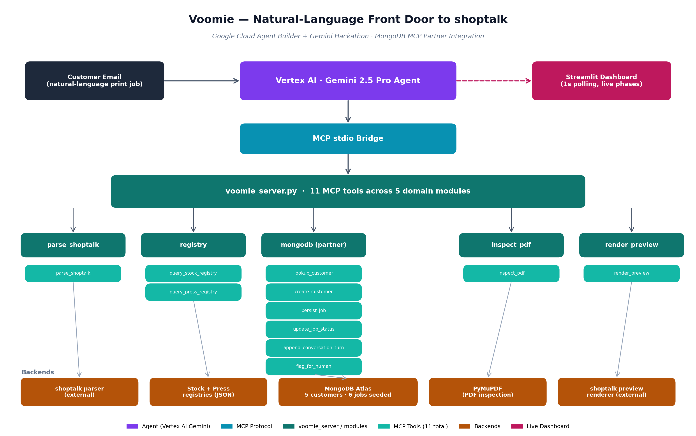

# Voomie

**Natural-language front door for print shops** — a Gemini-powered agent that turns customer print job emails into validated, production-ready job records.

Built for the [Google Cloud Agent Builder + Gemini Hackathon](https://googlecloud.devpost.com/) · MongoDB MCP partner integration.



---

## What it does

Print shop customers describe what they want in plain English — "I need 500 business cards on something heavy, glossy, ready next Friday." A CSR (customer service rep) translates that into a precise spec, checks stock availability, picks a press, and writes up the job.

Voomie does the CSR's first pass automatically:

1. Reads the customer email (or web-to-print intake, or MIS handoff)
2. Looks up the customer in MongoDB (or creates a new record)
3. Resolves vague language to concrete stock and press choices via JSON registries
4. Produces a structured job declaration in **shoptalk**, the shop's job-spec format
5. Validates the declaration against the shoptalk parser
6. Either: returns a ready-for-review job, asks the customer for clarification, or flags for human review with full context

Every step is logged to MongoDB. A Streamlit dashboard streams progress live at 1s polling.

---

## The three-layer vision

Voomie is one of three connected projects:

| Layer | Project | Role |
|---|---|---|
| 🗣️ Mouth | **Voomie** (this repo) | Natural-language intake — talk to customers |
| 🧠 Brain | **shoptalk** | Structured job-spec format — captures what was ordered |
| 🤲 Hands | **Printssistant** | PDF production execution — does the prepress work |

Voomie is the customer-facing front door. shoptalk is the immutable record. Printssistant is the existing revenue-generating app that does the actual production. Together: a print shop that runs on language.

> _shoptalk is maintained as a separate project. This repo treats it as a validating dependency — Voomie calls into the shoptalk parser as a subprocess; the format and grammar live elsewhere._

---

## Demo

**Live agent run, 87s end-to-end.** Watch the dashboard stream phase transitions in real time:

> _[link to 3-min demo video — TODO]_

### What the suite covers

17 fixtures total across two tiers, all `ok=true`, zero crashes:

**Tier 1 — standard scenarios (5/5 green)**

| Fixture | Final state | Notes |
|---|---|---|
| Chris Walton | `ready_for_review` | Multi-job, coating ordering conflict resolved |
| Cindy Meyer | `ready_for_review` | Clean single-job |
| Frank Delgado | `clarification_needed` | Missing PDF — agent asks customer |
| Ambiguous "J" | `clarification_needed` | "Hey i need stuff printed" → drafted CSR-grade clarifying reply |
| Walk-in Msg-4 | `ready_for_review` | Anonymous, bare-bones specs → resolved via registry inference |

**Tier 3 — adversarial scenarios (12/12 handled gracefully)**

Designed to break the agent. Tested contradictions, impossible spec combos, very long rambles, HTML-encoded input, bilingual messages, wrong customer matches, malformed contact info, unsupported stocks, coating conflicts, and one **prompt injection attempt**.

Highlights:
- **A11 (prompt injection)** — Agent recognized the attack in its own reasoning, refused, and continued the legitimate request without acknowledging the injection. Reasoning is captured verbatim in the conversation log.
- **A5 (bilingual)** — Customer wrote in Spanish. Agent replied in Spanish, unprompted.
- **A3 (long ramble)** — Agent detected an internal contradiction the customer didn't notice ("business cards" and "4×6 postcards" in the same message) and asked which they meant.
- **A12 (terminal-flag)** — Customer requested a finishing technique not supported by the shop's current spec format. Agent attempted self-correction, hit the wall, called `flag_for_human` with full structured context, and drafted a polite customer reply explaining the limitation in the same pass.

### Resilience numbers

- **17/17** runs completed without crashing
- **16/17** resolved through conversational paths (16 customer-facing) — only 1 hit the terminal flag, by design
- **~8 Gemini parameter typos auto-corrected per run** on average — concrete agentic resilience, not edge-case rescue
- **0 malformed conversation turns** across the entire suite

---

## Architecture

```
Customer Email
     ↓
Vertex AI · Gemini 2.5 Pro Agent
     ↓  (MCP stdio bridge)
voomie_server.py — 11 MCP tools across 5 domain modules
     ↓
┌────────────────┬─────────────────────────┬────────────────────────────┬───────────────┬──────────────────┐
│ parse_shoptalk │ registry                │ mongodb (partner)          │ inspect_pdf   │ render_preview   │
│ • parse_shoptalk │ • query_stock_registry │ • lookup_customer         │ • inspect_pdf │ • render_preview │
│                │ • query_press_registry  │ • create_customer          │               │                  │
│                │                         │ • persist_job              │               │                  │
│                │                         │ • update_job_status        │               │                  │
│                │                         │ • append_conversation_turn │               │                  │
│                │                         │ • flag_for_human           │               │                  │
└────────────────┴─────────────────────────┴────────────────────────────┴───────────────┴──────────────────┘
     ↓                ↓                          ↓                          ↓                ↓
shoptalk parser   JSON registries           MongoDB Atlas                PyMuPDF        shoptalk preview
(external)                                  (5 customers, 6 jobs)                       renderer (external)
                                                   ↓
                                         Streamlit Dashboard (1s polling, live phases)
```

See [`docs/voomie_architecture.png`](docs/voomie_architecture.png) for the diagram.

### Why MCP

Every capability the agent has is exposed as an MCP tool. This means:
- The agent's surface area is auditable in one file (`tools/voomie_server.py`)
- New tools can be added without touching the agent loop
- The same tools can be reused by other clients (Claude Code, Cursor, etc.) outside the agent

### Why MongoDB

MongoDB is the source of truth for everything the agent does between turns. Customer records, job history, conversation turns, flag context — all persisted. The dashboard reads directly from Mongo, so its view is always consistent with what the agent thinks happened. The 6 MongoDB MCP tools are load-bearing — without them, Voomie has no memory.

---

## Setup

### Prerequisites

- Python 3.11+
- Node.js (for MCP stdio bridge)
- shoptalk runtime (separate project — available on request)
- MongoDB Atlas cluster (free tier M0 is fine)
- GCP project with Vertex AI API enabled
- `gcloud auth application-default login` configured

### Install

```bash
git clone https://github.com/BmartOcho/voomie-agent
cd voomie-agent
pip install -r requirements.txt
```

### Environment

Create `.env`:

```
MONGODB_URI=mongodb+srv://<user>:<pass>@<cluster>.mongodb.net/voomie
GCP_PROJECT=<your-project-id>
GCP_LOCATION=us-central1
SHOPTALK_PATH=/path/to/shoptalk
```

### Seed the database

```bash
python scripts/seed_db.py
```

Creates 5 customers (Chris Walton, Sandra Reyes, Frank Delgado, Cindy Park, Walk-in) and 6 historical jobs.

### Run a fixture

```bash
python scripts/run_fixture.py chris
python scripts/run_fixture.py adv_a11_promptinjection
```

17 fixtures available — see `scripts/run_fixture.py` for the full list.

### Launch the dashboard

```bash
streamlit run dashboard/app.py
```

Open `http://localhost:8501`.

---

## Pre-demo checklist

Atlas free-tier clusters can drift between sessions. Before recording or judging:

- [ ] Atlas dashboard shows cluster status = "Active"
- [ ] Network Access allows `0.0.0.0/0` (or current IP)
- [ ] `python -c "from voomie.mongo import client; print(client.server_info()['version'])"` returns a version string
- [ ] All 5 seeded customers present: `db.customers.count_documents({})` returns 5
- [ ] Streamlit dashboard reachable at `localhost:8501`

---

## Roadmap

- **Inbound email integration** — currently fixtures + manual paste; next is direct IMAP/Gmail ingestion
- **PDF preflight feedback loop** — wire `inspect_pdf` results back into the agent so it can ask about file issues
- **Voice intake** — phone-call transcription → agent (the same back-end works)
- **Multi-shop tenancy** — registries and Mongo namespaces per shop
- **Connect to Printssistant** — once a job is `ready_for_review`, hand off to the production app

---

## License

MIT — see [LICENSE](LICENSE). Applies to this repo only; shoptalk and Printssistant are separately maintained and separately licensed.

## Built by

[Benjamin Martinec](https://github.com/BmartOcho) — prepress operator at Voom Group, Dallas TX. Voomie was built to solve a problem I see every day: customer intent buried in three-paragraph emails, and a CSR translating it by hand into something my prepress queue can actually use.
